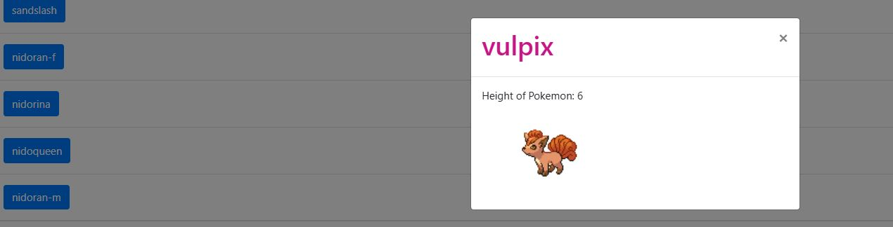

# Simple-js-app

A simple Pokedex (Pokemon look-up app) with details and images of the first 150 Pokemon is written in Javascript.

Pokemon items are sourced from PokeAPI. (https://pokeapi.co/api/v2/pokemon/?limit=150)

## How to use

Runs in browser via the index.html in the root folder.

Scrolls further down after clicking on at least one Pokemon on the startpage.

## Screenshot of the app:

## Systems and programs:

Uses jquery 3.5.1 min, popper.js 1.14.7, bootstrap 4.3.1, promise-polyfill, and fetch-polyfill.